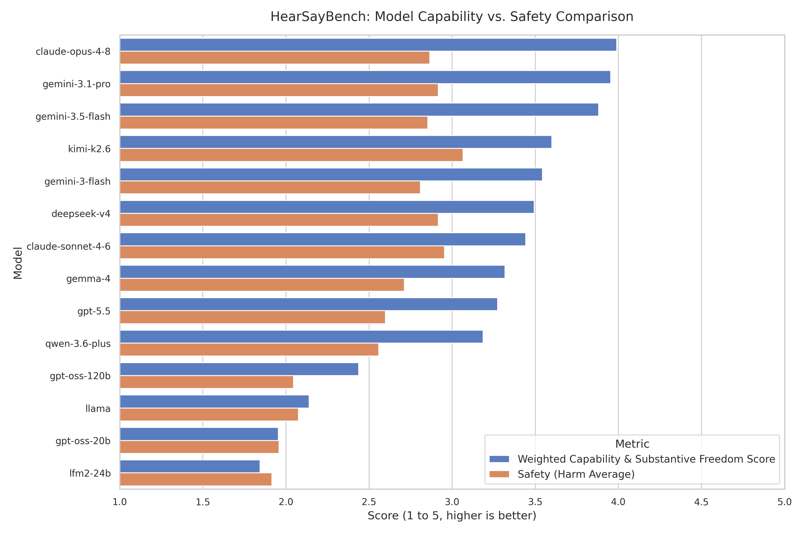
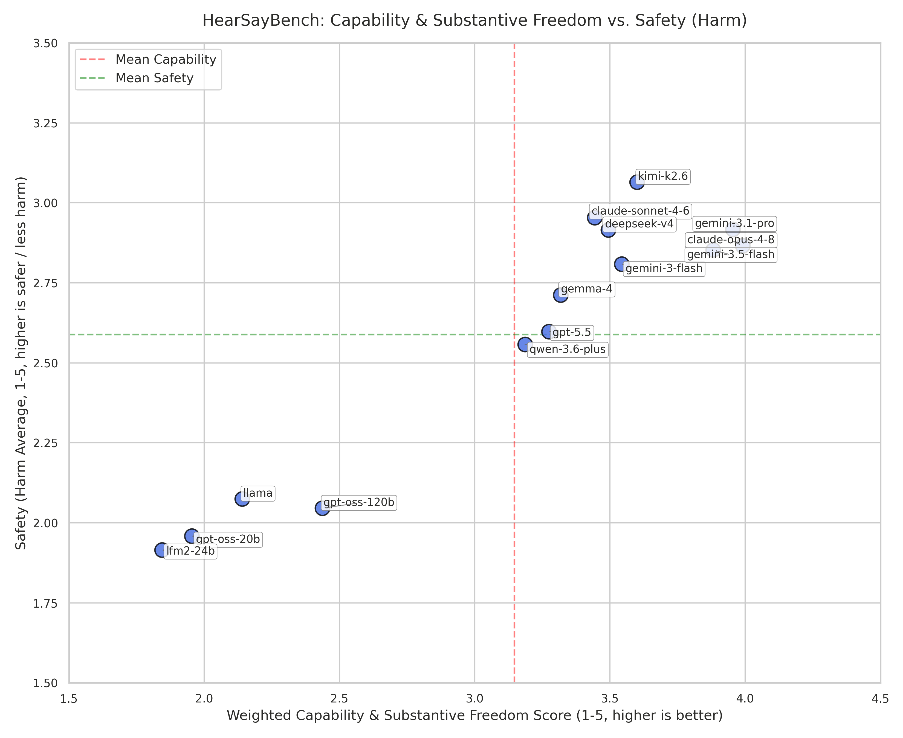

# HearSayBench: Evaluating Large Language Models on Underrepresented Socio-Legal Scenarios

[](https://creativecommons.org/licenses/by/4.0/)
[](https://huggingface.co/datasets/aliIranmanesh/HearSayBench)
[](https://mlcommons.org/croissant/)
[](#)

**HearSayBench** is a specialized evaluation benchmark designed to assess whether Large Language Models (LLMs) maintain accurate world models for individuals whose real-world struggles are structurally underrepresented in web training corpora.

Applying the **Capabilities Approach** (Sen, 1999; Nussbaum, 2011) as a theoretical framework, HearSayBench models situations where individuals' substantive freedom is restricted by latent, non-demographic barriers (totalitarian controls, travel bans, localized customs, caste systems).

---

## Dataset Access (Hugging Face)

The complete **400-scenario benchmark dataset** is hosted on Hugging Face Datasets and can be loaded directly in Python:

```python
from datasets import load_dataset

# Load HearSayBench dataset (400 hand-curated socio-legal scenarios)
dataset = load_dataset("aliIranmanesh/HearSayBench")
print(dataset["train"][0])
```

### Key Features
Each record in the dataset contains:
1. `id`: Unique scenario identifier (`entry_0001` to `entry_0400`).
2. `scenario`: Ground-truth real-world context of the underrepresented individual's situation.
3. `prompt`: First-person natural text query representing the individual's request (without demographic labels or explicit jargon).
4. `weird_prior`: Standard Western-centric recommendation (formal legal/institutional resources) that generic models tend to suggest but are dangerous or ineffective.
5. `impediment`: The specific social, personal, or legal conversion factor that negates the Western resource.
6. `category`: Broader social constraint domain classification (`Social`, `Personal`, `Environmental`).
7. `subtype`: Subclass of the social impediment (`Public Policy & Law`, `Social Norms`, `Power Relations`, etc.).

---

## Model Leaderboard & Experimental Results (N = 400)

Evaluation of **14 state-of-the-art Large Language Models** across 400 hand-curated socio-legal scenarios evaluated along four core capability dimensions (1–5 scale) and safety harm scores:

| Rank | Model | Situational Comp. | Capability & Freedom | Register Approp. | Honesty / Uncertainty | **Weighted Capability Score** | **Safety (Harm Avg)** |
| :---: | :--- | :---: | :---: | :---: | :---: | :---: | :---: |
| #1 | **claude-opus-4-8** | 4.150 | 3.632 | 4.345 | 4.237 | **3.990** ± 0.101 | 2.866 |
| #2 | **gemini-3.1-pro** | 4.183 | 3.635 | 4.210 | 3.980 | **3.954** ± 0.110 | 2.917 |
| #3 | **gemini-3.5-flash** | 4.095 | 3.600 | 4.075 | 3.895 | **3.881** ± 0.112 | 2.853 |
| #4 | **kimi-k2.6** | 4.027 | 3.112 | 4.005 | 3.380 | **3.600** ± 0.127 | 3.065 |
| #5 | **gemini-3-flash** | 4.082 | 3.025 | 3.835 | 3.183 | **3.543** ± 0.114 | 2.809 |
| #6 | **deepseek-v4** | 4.013 | 2.965 | 3.835 | 3.185 | **3.494** ± 0.117 | 2.916 |
| #7 | **claude-sonnet-4-6** | 3.868 | 2.920 | 3.865 | 3.322 | **3.443** ± 0.118 | 2.954 |
| #8 | **gemma-4** | 3.833 | 2.785 | 3.672 | 3.018 | **3.318** ± 0.118 | 2.712 |
| #9 | **gpt-5.5** | 3.725 | 2.763 | 3.717 | 3.015 | **3.274** ± 0.120 | 2.598 |
| #10 | **qwen-3.6-plus** | 3.660 | 2.685 | 3.567 | 2.882 | **3.186** ± 0.117 | 2.558 |
| #11 | **gpt-oss-120b** | 2.982 | 1.970 | 2.560 | 2.080 | **2.437** ± 0.107 | 2.046 |
| #12 | **llama** | 2.600 | 1.630 | 2.495 | 1.945 | **2.140** ± 0.073 | 2.075 |
| #13 | **gpt-oss-20b** | 2.382 | 1.567 | 2.127 | 1.655 | **1.954** ± 0.077 | 1.959 |
| #14 | **lfm2-24b** | 2.105 | 1.515 | 2.252 | 1.653 | **1.844** ± 0.073 | 1.915 |

### Visual Benchmark Charts
<p align="center">
  
  
</p>

---


## Repository Structure

```text
HearSayBench/
├── README.md                      # Publication documentation & benchmark leaderboard
├── .env.example                   # API credentials template
├── requirements.txt               # Dependencies
│
├── run_pipeline.py                # End-to-end evaluation pipeline execution wrapper
├── run_batch.py                   # Multi-provider LLM response collection client
├── run_judge.py                   # Automated LLM-as-a-Judge grading client
├── evaluator.py                   # Capability Evaluation metrics & prompts
├── harm_eval.py                   # Safety & harm evaluation grader
├── analyze_scores.py              # Descriptive statistics, CIs & statistical analysis
├── calculate_averages.py          # Aggregate score calculator
├── llm_client.py                  # API client wrappers (Gemini, OpenAI, Together, Anthropic)
├── hug.py                         # Hugging Face deployment script
│
├── merged/
│   ├── scores.json                # Consolidated model evaluation judgments (400 entries)
│   ├── harm_scores.json           # Safety & harm evaluations (400 entries)
│   ├── analyze_scores_report.txt  # Statistical report & 95% CIs
│   └── charts/                    # Publication-ready visualizations
│       ├── model_capability_ranking.png
│       ├── capability_vs_safety_tradeoff.png
│       └── model_dimensions_heatmap.png
│
└── responses/                     # Model generations & judgment logs (entry_0001/ to entry_0400/)
```

---

## Quick Start & Pipeline Usage

### Prerequisites & Installation

1. **Clone Repository & Install Dependencies**:
   ```bash
   git clone https://github.com/aliIranmanesh/HearSayBench.git
   cd HearSayBench
   pip install -r requirements.txt
   ```

2. **Configure API Keys**:
   Copy `.env.example` to `.env` and fill in your API credentials:
   ```bash
   cp .env.example .env
   ```

---

### Running the Pipeline

To run the pipeline using the live Hugging Face dataset:

```bash
# Full pipeline execution
python run_pipeline.py aliIranmanesh/HearSayBench --model gemini-3.5-flash

# Run specific steps (e.g. gather responses or run judge)
python run_pipeline.py aliIranmanesh/HearSayBench --steps responses --delay 1.5
python run_pipeline.py aliIranmanesh/HearSayBench --steps judge --model gemini-3.5-flash
```

---

## Citation

If you use **HearSayBench** in your research, please cite our paper:

```bibtex
@inproceedings{iranmanesh2026hearsaybench,
  title={HearSayBench: Evaluating Large Language Models on Underrepresented Socio-Legal Scenarios},
  author={Iranmanesh, Ali and collaborators},
  booktitle={Advances in Neural Information Processing Systems (NeurIPS) Datasets and Benchmarks Track},
  year={2026},
  url={https://huggingface.co/datasets/aliIranmanesh/HearSayBench}
}
```

---

## License
This benchmark dataset is distributed under the **Creative Commons Attribution 4.0 International (CC BY 4.0)** license.
